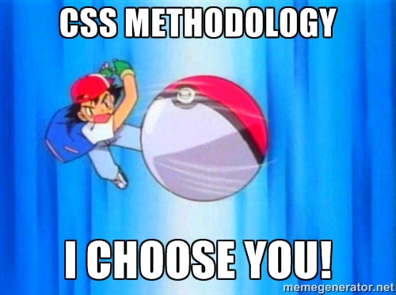

<!-- .slide: data-background="./reveal.js/img/title.png" -->

<!-- Matt -->
# Building Your own Widget with ArcGIS API for JavaScript

### Matt Driscoll – [@driskull](https://twitter.com/driskull)
### JC Franco – [@arfncode](https://twitter.com/arfncode)

---

# Agenda

- Widgets
- Best practices
- Building our widget
  - 3.x
  - 4.x
- Testing

---

# Widgets

- What?
  - Encapsulated
  - Cohesive
  - Single-purpose pieces of functionality 
- Why?
  - Reusable
  - Interchangeable
- How?
 - different frameworks
 - focus on dojo

---

<!-- JC -->
# Asynchronous Module Definition (AMD)

- Asynchronous loading
- Web-based solution
- Lazy loading
- Fewer globals
- Dependency handling

---

# Asynchronous Module Definition (AMD)

- `define`
  ```js
  // moduleA.js
  define(["moduleB"], function (moduleB) {
    // module API
    return {
      _data: 100,
      calculate: function () {
        moduleB.calculate(this._data);
      }
    };
  });
  ```
- `require`
  ```js
  // main.js
  require(["moduleA"], function (moduleA) {
    moduleA.calculate();
  });
  ```

---

# _WidgetBase

what you get

- Lifecycle
  - `constructor`
  - `postMixInProperties`
  - `buildRendering`
  - `postCreate`
  - `startup`
  - `destroy`
- Events
- Getters/Setters
- Property watching

---

<!-- Matt -->
# Simple widget example

```js
// MyWidget.js
define([
  "dijit/_WidgetBase",
  // ...
], 
function(
  _WidgetBase,
  // ...
) {
  return  _WidgetBase.createSubclass({
    // widget magic here! °˖✧◝(⁰▿⁰)◜✧˖°
  });
});
```

[Simple widget](./demo/preamble/dijit-lifecycle.html)

---

# Splitting it up (HTML)

- Extract HTML to separate file
- Mix in `dijit/_TemplatedMixin`
  - Renders HTML based on a template string
  - Create DOM node attachments

---

# Splitting it up (HTML) Example

```html
<!-- ./templates/MyWidget.html -->
<div>
  <label>°˖✧◝(⁰▿⁰)◜✧˖°</label>
</div>
```

```js
// ./MyWidget.js
define([
  "dijit/_WidgetBase",
  "dijit/_TemplatedMixin",
  "dojo/text!./templates/MyWidget.html"
], 
function (
  _WidgetBase, _TemplatedMixin, 
  template
) {
  
  return _WidgetBase.createSubclass([_TemplatedMixin], {
    
    templateString: template,
    
    // widget magic here! °˖✧◝(⁰▿⁰)◜✧˖°
    
  });
  
});
```

---

# Splitting it up (CSS)

- Extract widget-specific styles to separate stylesheet
- @import widget stylesheet wherever applicable

---

# Best practices – Accessibility (a11y)

- Enable your application to be used by everyone
- Consider other input devices besides the mouse
  - Keyboard
  - Touch
  - Screen reader

---

# Best practices – Internationalization (i18n)

- Keep text separate from application logic
- Support multiple languages
- Helps ease translation

```javascript
define({
  root: ({
    "button": "Home",
    "title": "Default extent"
  }),
  "ar": 1,
  ...
  "zh-cn": 1
});
```

---

# Best practices – DOM Manipulation

Here to help...

- `dojo/dom`
- `dojo/dom-attr`
- `dojo/dom-class`
- `dojo/dom-construct`
- `dojo/dom-style` (used sparingly)

---

<!-- JC -->
# Best practices – Styling

Use CSS classes

```html
<style>
  .awesome-block {
    background-color: chartreuse;
  }
</style>

<div class="awesome-block"></div>
```

and not inline styles
        
```html
<div style="background-color: chartreuse"></div>
```

---

# Best practices – Styling

Mind specificity

```html
<style>   
  #red { background-color: red; }  /* ID */

  .blue { background-color: blue; }  /* class */
  .green { background-color: green; }  /* class */
  
  .blue.green { background-color: yellow; }  /* 2 classes */
</style>

<div id="red" 
    class="square green blue" 
    style="background-color: orange"></div>
```

* [Result](http://jsbin.com/kuqunasula/edit?html,output)
* [Specificity calculator](http://specificity.keegan.st/) 

---

# Best practices – Styling

### CSS Methodologies

- Establish guidelines/rules for maintainable CSS
  - CSS & HTML best practices
  - Naming conventions
  - Ordering/grouping of CSS rules
- No silver bullet - choose what's best for your project/team
- Flavors
  - [Block-Element-Modifier (BEM)](http://getbem.com/)
  - [Scalable and Modular Architecture for CSS (SMACSS)](https://smacss.com/)
  - [Object Oriented CSS (OOCSS)](https://github.com/stubbornella/oocss/wiki)
  - [SUIT CSS](http://suitcss.github.io/)
  - [Atomic OOBEMITSCSS](http://www.sitepoint.com/atomic-oobemitscss/)
  - ETC LOL...

---



---

# Best practices – Styling

### BEM

- Uses delimiters to separate block, element, modifiers
- Provides semantics (albeit verbose)
- Keeps specificity low
- Scopes styles to blocks

```css
/* block */
.example-widget {} 

/* block__element */
.example-widget__input {}   
.example-widget__submit {}

/* block--modifier */
.example-widget--loading {}

/* block__element--modifier */
.example-widget__submit--disabled {}
```

---

<!-- Matt -->
# Best practices – Styling

### Preprocessors

- Benefits
  - Variables
  - Mixins
  - @import & @extend
- Allow us to
  - Restyle
  - Theme
  - Write less code
- Flavors
  - [Sass](http://sass-lang.com)
  - [Stylus](http://stylus-lang.com/)
  - [Less](http://lesscss.org/)

---

# WikiWidget (requirements)

* Use Wikipedia API to geosearch for entries
* Display results in a list
* List items should center on the map and display a popup
* The popup should have a link for more info (wiki page) 
* Use Sass to compile stylesheets 
* Apply BEM

---

# Building WikiWidget


---

# Building WikiWidget the 3x way

[demo](./demo/3x/index.html)

---

<!-- JC -->
# Future (4.x)

- Widget Architecture
  - View – the face
  - ViewModel – the brain
- Reusable/Testable core widget logic sans UI concerns
- Framework compatibility
- Separates concerns

---

# View

- Uses ViewModel APIs to render the UI
- View-specific logic resides here 


---

# ViewModel

- Core logic of widget resides here
- Provides necessary APIs for the view to do it's thing
- No DOM/UI concerns
- Data is encapsulated here as well
- Requires thinking, no silver-bullet


---

# Example: BasemapToggle

- [BasemapToggle.js (view)](https://developers.arcgis.com/javascript/beta/api-reference/js/source-code/widgets/BasemapToggle.js)
- [BasemapToggleViewModel](https://developers.arcgis.com/javascript/beta/api-reference/esri-widgets-BasemapToggle-BasemapToggleViewModel.html)

---

# ViewModel integration demos

- [Angular](http://odoe.github.io/esrijs4-vm-angular2/) – https://github.com/odoe/esrijs4-vm-angular2
- Ember – https://github.com/odoe/esrijs4-vm-ember
- [React](http://odoe.github.io/esrijs4-vm-react/) – https://github.com/odoe/esrijs4-vm-react
- [Elm](http://odoe.github.io/esrijs4-vm-elm/dist/) – https://github.com/odoe/esrijs4-vm-elm

---

# WikiWidget 4.x

[demo](./demo/4x/index.html)

---

<!-- Matt -->
# Testing

- Why?
  - Writing tests is an investment
  - Helps build safety net to catch regressions as we change the codebase
- How?
  - Multiple flavors of testing frameworks
    - Intern – https://theintern.github.io/intern
    - QUnit – https://qunitjs.com/
    - Jasmine – http://jasmine.github.io/

---

# Testing (Frameworks)

- Leverage the power of a framework!
  - Well-established
  - Documented
  - Community
  - Support
  - Automation

- Flavors
  - Intern – https://theintern.github.io/intern
  - QUnit – https://qunitjs.com/
  - Jasmine – http://jasmine.github.io/

---

# Intern
 
- Flexible
  - Support for different testing interfaces 
    - Object (basic)
    - Test-driven development (TDD)
    - Behavior-driven development (BDD)
    - QUnit 1
  - Support for sync and async tests
- Unit & functional tests
- Great documentation
- Node & browser test runners
- Supported modules for testing: AMD, CommonJS, transpiled
- Continuous Integration

###### 

---

<!-- JC -->
# Test-writing tips

- Test in isolation
  - mock/stub/spy when needed 
    - sinon.js – http://sinonjs.org/
    
---

# Test-writing tips

- Strive for readable tests

  ```js
  "foo() with invalid value": function(){
      var subject = new Subject();
      
      var result = subject.foo(null);
    
      assert.isUndefined(result);
    }
  ```

---

# Test-writing tips  
  
- Recommended structure for tests

  ```js
  "test": function() {
    // setup
    
    // test
  
    // assertion
  }
  ```

---

# Test-writing tips
  
- Single logical assertion per test

  ```js
  "result of foo()": function() {
      var subject = new Subject();
      
      var result = subject.foo({
        items: 5
      });
    
      assert.instanceOf(result, Result, "is of Result type");
      assert.lengthOf(result.items, 5, "number of items are generated");
      assert.equal(result.title, "", "default title is ''");
    }
  ```

---

# Test-writing tips

- Make sure tests fail when they're supposed to

  ```js
  "someMethod returns 'DevSummit 2016'": function() {
    // ":D" does NOT fail
    assert.ok(util.someMethod());  
  }
  ```
  
  ```js
  "someMethod returns 'DevSummit 2016'": function() {
    assert.equal(util.someMethod(), "DevSummit 2016");
  }
  ```

---

# Test-writing tips

- Strive to make tests fail fast

  ```js
  "test async method": function() {
      return util.someAsyncMethod({
        delay: 0 // default is 2000ms
      });
    }
  ```  

---

## Recommended sessions

- ArcGIS API for JavaScript: Discover 4.0 the Next Generation
- The Road Ahead: ArcGIS API for JavaScript
- Using and Customizing the ArcGIS API for JavaScript Widgets
- CSS: Rules to Style By 
- Accessible Web Mapping Apps: ARIA, WCAG and 508 Compliance 
- Modern Tools for the Modern Web Developer
- Optimizing Your JavaScript App for Performance
- Full Stack End to End JavaScript Testing with Intern 
- Using TypeScript with ArcGIS JS API Development 
- Write Better Code
- Ask a UX & UI Expert 

---

## Additional Resources

ArcGIS Github -> Presentations Devsummit 2016 -> Building your own widget

- [Documentation - 4.0 beta](https://developers.arcgis.com/javascript/beta/)

---

# Rate Us!

## Esri Events Mobile App - http://www.esri.com/events/eventsapp

- iOS
- Android

Search for *"Building your own widget"*.

---

# Q & A

Questions?

---

<!-- .slide: data-background="./reveal.js/img/end.png" -->
